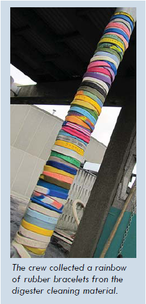

<!------------------------------------------------------------>
<!-- Topic: xxx -->

<h1>Slide 0</h1>

--SUBSLIDE--

<h2>Sub Slide 0--1</h2>

--SUBSLIDE--

<h2>Sub Slide 0--2</h2>
This is an inline link to [idEditor](http://ideditor.com/  "Link to idEditor").

--SUBSLIDE--

<h2>Sub Slide 0--3</h2>
This is an inline link to [qGIS](http://www.qgis.org/en/site/ "Link to qGIS").

<!------------------------------------------------------------>
--SLIDE--
<!-- Topic: Geography -->

<h1>Geography!</h1>

--SUBSLIDE--

<h2>Sub Slide 1--1</h2>

--SUBSLIDE--

<h2>Sub Slide 1--2</h2>

<!------------------------------------------------------------>
--SLIDE--
<!-- Topic: zzz -->

<h1>Slide 2</h1>

--SUBSLIDE--

<h2>Sub Slide 2--1</h2>

--SUBSLIDE--

<h2>Sub Slide 2--2</h2>

<!------------------------------------------------------------>
--SLIDE--
<!-- Topic: yyy -->

<h1>Slide 3</h1>

--SUBSLIDE--

<h2>Sub Slide 3--1</h2>

--SUBSLIDE--

<h2>Sub Slide 3--2</h2>

