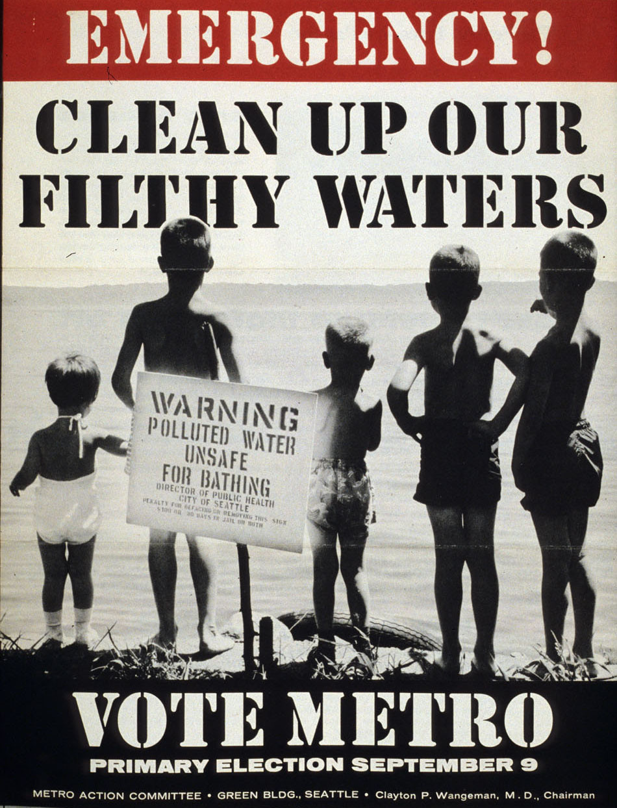
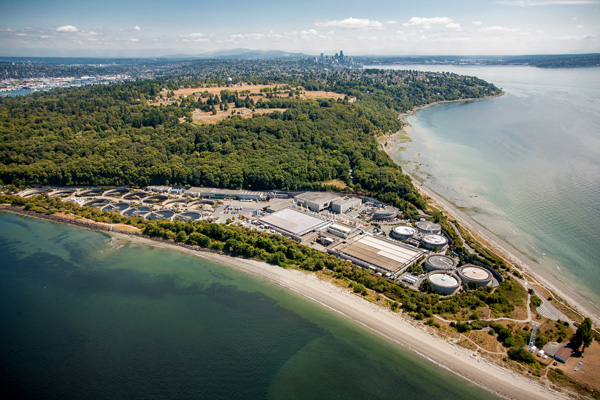
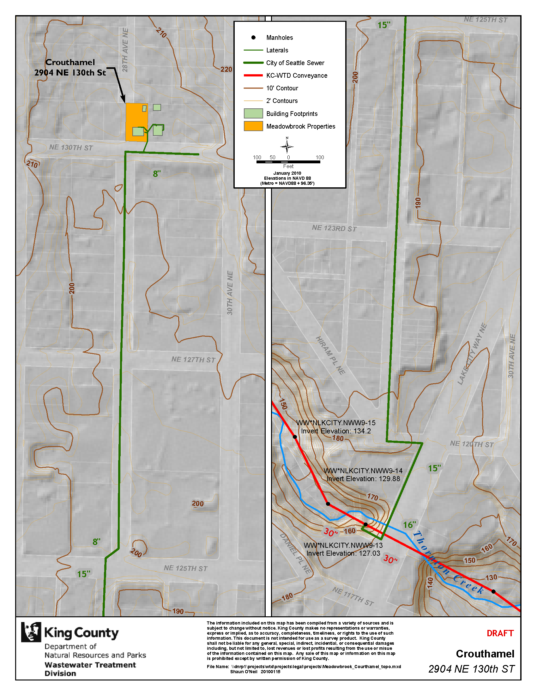

<!------------------------------------------------------------>
<!-- Topic: xxx -->

Maps and
========

--SUBSLIDE--

<h2>My School</h2>

--SUBSLIDE--

<h2>What I studied.</h2>

<!------------------------------------------------------------>
--SLIDE--
<!-- Topic: Geography -->

<h1>Geography!</h1>

--SUBSLIDE--

<h2>Exploring how the earth impacts people...</h2>

--SUBSLIDE--

--SUBSLIDE--

<h2>And how people impact the earth.</h2>

--SUBSLIDE--

<h2>These relationships might not be what you expect.</h2>

--SUBSLIDE--

<h2>Once upon a time...</h2>

--SUBSLIDE--

<h2>Geology</h2>

--SUBSLIDE--

<h2>Agriculture</h2>

--SUBSLIDE--

<h2>Social (Moral?)</h2>

--SUBSLIDE--

<h2>Demographics</h2>

--SUBSLIDE--

<h3>Ancient Sea Levels to Current Political Implications!</h3>

--SUBSLIDE--

<h3>Ghost Map</h3>

<!------------------------------------------------------------>
--SLIDE--
<!-- Topic: Sewers -->

<h1>Sewers</h1>

If you don't love them,
you should.

--SUBSLIDE--

<h2>Water Cycle</h2>

--SUBSLIDE--

<h2>Get that dirty water away from my house!</h2>

--SUBSLIDE--

<h2>We didn't do a good job at first.</h2>

--SUBSLIDE--

<h2>What should we do with that water?</h2>

--SUBSLIDE--

<h2>Everybody wants that dirty water away from their house</h2>

--SUBSLIDE--

<h2>Your poop...</h2>
(and pee,
 and soap,
 and water,
 and roof runoff,
etc., etc., etc.)
<h2>...goes here.</h2>

--SUBSLIDE--

<h2>This is how it gets there from McClure.</h2>

--SUBSLIDE--

<h2>We have people that clean up after you...</h2>

--SUBSLIDE--

<h2>...but help them out.</h2>
Don't flush anything but water, toilet paper, and things that come from your body!

--SUBSLIDE--

<h2>[Fatberg!](http://youtu.be/ef9lrDkeXZ0  "Link to Fatberg")</h2>

--SUBSLIDE--

<h2>Don't swim after the rain!</h2>
[Montlake CSO](images/WWMontlakeCSO.mpg "Link to Montlake CSO")

[University CSO](images/WWUniversityCSO.mpg  "Link to University CSO")

<!------------------------------------------------------------>
--SLIDE--
<!-- Topic: What I do.-->

<h2>My work with sewers</h2>

--SUBSLIDE--

<h2>Must have data!</h2>
Garbage in, garbage out.

--SUBSLIDE--

<h2>How to we get this data?</h2>
GPS (Global Postitioning Systems)

--SUBSLIDE--

<h2>How to we get this data?</h2>
Engineering Drawings

--SUBSLIDE--

<h2>Answering big questions...</h2>

--SUBSLIDE--

<h2>...and small questions.</h2>

--SUBSLIDE--

<h2>Fremont Siphon</h2>

--SUBSLIDE--

<h2>Why is it important?</h2>

--SUBSLIDE--

<h2>Oops!</h2>
We really need to know where our infrastrucure is.

--SUBSLIDE--

<h2>Call before you dig!</h2>

--SUBSLIDE--

<h2>We'd hate to misplace this one.</h2>

<!------------------------------------------------------>

--SUBSLIDE--

<h2>Duwamish Superfund Site</h2>
This river is dirty!

--SUBSLIDE--

<h2>Duwamish Superfund Site</h2>
Let's find the source of this toxic stuff.

--SUBSLIDE--

<h2>Duwamish Superfund Site</h2>
Now, how are we going to fix it?

--SUBSLIDE--

<h2>Duwamish Superfund Site</h2>
But wait, do we really understand?

--SUBSLIDE--

<h2>Duwamish Superfund Site</h2>
Air, land, and water!

<!------------------------------------------------------>

--SUBSLIDE--

<h2>GSI - Green Stormwater Infrastructure</h2>
Nature might know better than us.

--SUBSLIDE--

Where is the water coming from?

--SUBSLIDE--

Take a look at the whole basin.

--SUBSLIDE--

Where should we be working?

--SUBSLIDE--

This is a good location.

<!------------------------------------------------------>

--SUBSLIDE--

<h2>Legal</h2>
Sometimes bad things happen...

--SUBSLIDE--

<h2>Legal</h2>
...and people think we've done something wrong.

--SUBSLIDE--

Let's look at their house...

--SUBSLIDE--

And how far they are from our line.

<!------------------------------------------------------>

--SUBSLIDE--

<h2>Climate Change</h2>
Seas are rising!

--SUBSLIDE--

What areas will be affected?

--SUBSLIDE--

Will any of our stuff get wet?

--SUBSLIDE--

Is extra stuff getting into our pipe?

--SUBSLIDE--

Whoa!

--SUBSLIDE--

How about our big important stuff?

<!------------------------------------------------------>

--SUBSLIDE--

<h2>I love my job!</h2>
Data!

--SUBSLIDE--

Graphics!

--SUBSLIDE--

Analysis!

--SUBSLIDE--

Even programming!

--SUBSLIDE--

And websites!

[King County Flow Data Portal](http://www.kingcounty.gov/environment/wastewater/CSI/FlowMonitoring/DataPortal.aspx "Link to FlowDataPortal")

<!------------------------------------------------------------>
--SLIDE--
<!-- Topic: Other Stuff -->

<h1>Other Cool Stuff You Should Check Out!</h1>

--SUBSLIDE--

<h2>Wikipedia for Geography!</h2>
Help map the world!

[Open Street Map.](http://www.openstreetmap.org/#map=4/35.21/-96.64  "Link to OSM")

--SUBSLIDE--

<h2>Geography for humanitarian purposes.</h2>
<iframe src="//player.vimeo.com/video/9182869" width="500" height="281" frameborder="0" webkitallowfullscreen mozallowfullscreen allowfullscreen></iframe> 

<a href="http://vimeo.com/9182869">OpenStreetMap - Project Haiti</a> from <a href="http://vimeo.com/itoworld">ItoWorld</a> on <a href="https://vimeo.com">Vimeo</a>.

--SUBSLIDE--

<h2>Get your own, free, GIS.</h2>
[qGIS](http://www.qgis.org/en/site/ "Link to qGIS")

--SUBSLIDE--

<h2>Explore your own sewers.</h2>
[Seattle Side Sewer Cards](http://web1.seattle.gov/dpd/sidesewercardsv2/ "Link to Side Sewer Cards")

--SUBSLIDE--

<h2>Puget Sound Video</h2>
<iframe src="//player.vimeo.com/video/51603152" width="500" height="281" frameborder="0" webkitallowfullscreen mozallowfullscreen allowfullscreen></iframe> 

<a href="http://vimeo.com/51603152">Drained: Urban Stormwater Pollution</a> from <a href="http://vimeo.com/earthfix">EarthFix</a> on <a href="https://vimeo.com">Vimeo</a>.
 

<!------------------------------------------------------------>
--SLIDE--
<!-- Topic: Other Stuff -->

<h3>Important stuff at the end</h3>

Shaun O'Neil

shaun.oneil@kingcounty.gov

206.477.4432

This presentation:

http://defiantshaun.github.io/revealz/
